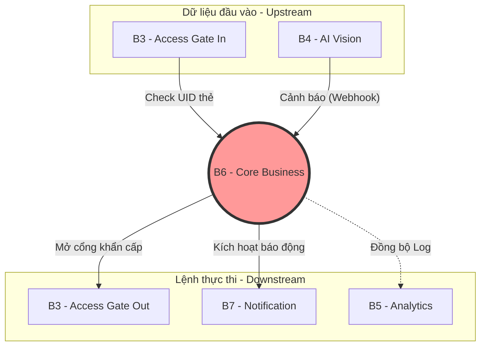
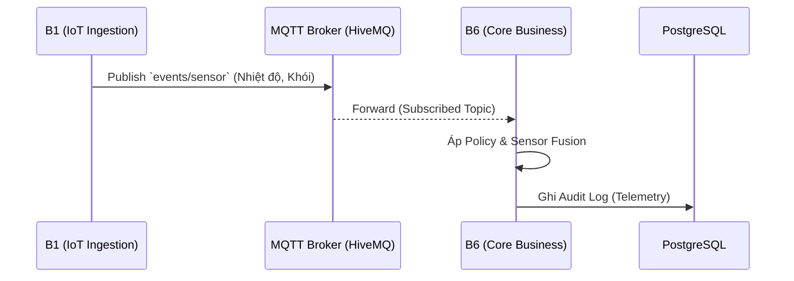
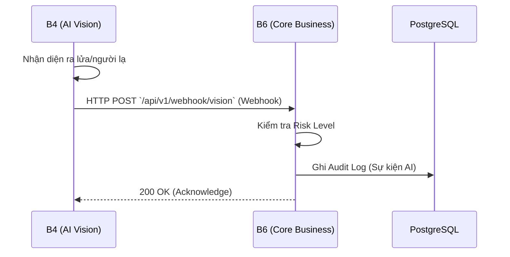
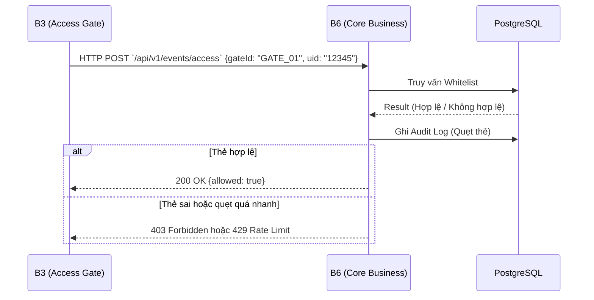
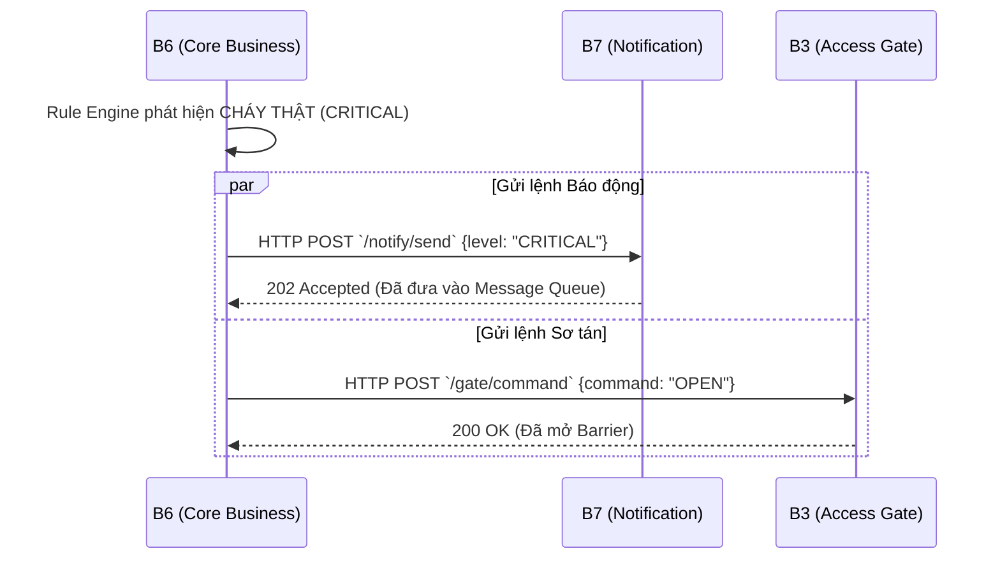
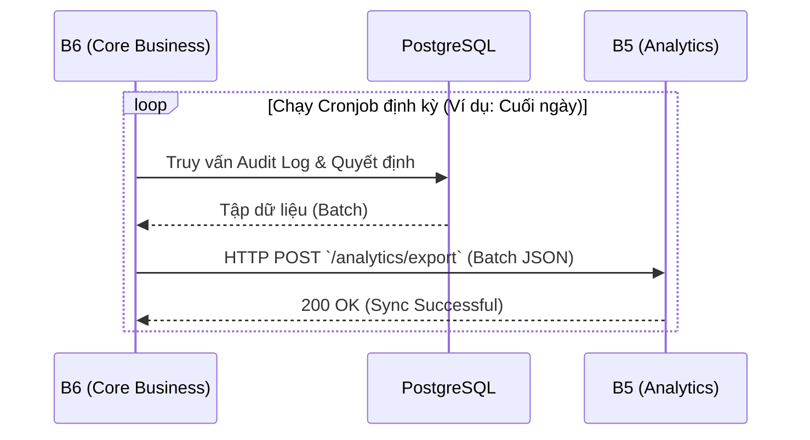

# LỜI MỞ ĐẦU

Trong thời đại công nghệ số 4.0, ứng dụng công nghệ thông tin vào công tác quản lý và vận hành trường học đang là xu thế tất yếu nhằm tối ưu hóa nguồn lực và đảm bảo an toàn tối đa cho sinh viên. Mô hình "Khuôn viên thông minh" (Smart Campus) đã và đang chứng minh được tính ưu việt thông qua khả năng kết nối vạn vật, tự động hóa quy trình và phân tích dữ liệu theo thời gian thực.

Nhận thức được tầm quan trọng đó, dưới sự hướng dẫn tận tình của giảng viên, nhóm chúng em đã quyết định lựa chọn đề tài **"Xây dựng hệ thống Smart Campus Operations Platform - Phân hệ Core Business (B6)"** làm đồ án môn học. 

Khác với các ứng dụng nguyên khối (Monolithic) truyền thống, hệ thống Smart Campus được thiết kế dựa trên kiến trúc vi dịch vụ (Microservices) chạy trên nền tảng mạng LAN ảo. Trong đó, hệ thống được chia thành nhiều nhóm vệ tinh như IoT Sensor, AI Vision, Access Gate và Notification. Sự phân tán này mang lại tính linh hoạt cao nhưng cũng đặt ra một bài toán cực kỳ hóc búa về việc đồng bộ, kiểm soát và điều phối luồng dữ liệu khổng lồ. 

Để giải quyết bài toán đó, **Phân hệ Core Business (B6)** ra đời, đóng vai trò như một "bộ não" trung tâm. Mục tiêu cốt lõi của đề tài là xây dựng một hệ thống backend mạnh mẽ, có khả năng lắng nghe hàng nghìn luồng sự kiện từ các thiết bị ngoại vi, xử lý logic thông minh (Rule Engine), chống các hiện tượng báo động giả (Sensor Fusion), và điều phối các lệnh vật lý khẩn cấp (mở cửa, hú còi) một cách an toàn, chính xác và không có độ trễ.

Mặc dù đã nỗ lực hết mình trong quá trình nghiên cứu, thiết kế và lập trình, nhưng do hạn chế về thời gian cũng như kinh nghiệm thực tiễn, đồ án chắc chắn không tránh khỏi những thiếu sót nhất định. Nhóm chúng em rất mong nhận được sự quan tâm, đánh giá và đóng góp ý kiến từ các thầy cô giáo để đề tài được hoàn thiện hơn và có cơ hội ứng dụng vào thực tiễn trong tương lai.

Chúng em xin chân thành cảm ơn!

---

# CHƯƠNG 1: TỔNG QUAN VÀ PHÂN TÍCH NGHIỆP VỤ

## 1.1. Giới thiệu chung
### 1.1.1. Bối cảnh hệ thống
Trong kỷ nguyên chuyển đổi số và phát triển đô thị thông minh, việc ứng dụng công nghệ IoT (Internet of Things) và Trí tuệ Nhân tạo (AI) vào quản lý trường học đang trở thành một xu thế tất yếu. Tại Trường Đại học Đại Nam (DNU) nói riêng và các trường đại học quy mô lớn nói chung, số lượng sinh viên, cán bộ giảng viên cùng các phương tiện ra vào khuôn viên ngày càng tăng cao. Kéo theo đó là những thách thức khổng lồ về công tác bảo đảm an ninh, phòng chống cháy nổ và quản lý luồng người di chuyển. Các phương pháp quản lý truyền thống dựa vào sức người (bảo vệ đi tuần tra, kiểm tra thẻ sinh viên bằng mắt thường) đã bộc lộ rõ sự chậm trễ, kém hiệu quả và tiềm ẩn nhiều sai sót.

Đứng trước bài toán đó, dự án **Smart Campus Operations Platform** (Nền tảng Quản lý Khuôn viên Thông minh) được thai nghén và phát triển. Dự án áp dụng triệt để mô hình kiến trúc phân tán (Microservices Architecture), chia nhỏ hệ thống thành các nhóm dịch vụ vệ tinh chuyên biệt: thu thập dữ liệu cảm biến IoT (Nhóm B1, B2), giám sát an ninh bằng AI Vision (Nhóm B4), kiểm soát thiết bị cổng từ Access Gate (Nhóm B3) và hệ thống phát thanh thông báo (Nhóm B7).

Tuy nhiên, đặc thù lớn nhất của kiến trúc Microservices chính là "sự phân mảnh". Hàng ngàn gói tin dữ liệu thô từ các cảm biến nhiệt độ, nồng độ khói, lịch sử quẹt thẻ sinh viên hay hình ảnh nhận diện khuôn mặt liên tục được gửi về máy chủ một cách rời rạc và hỗn loạn. Nếu không có một trung tâm điều phối đủ thông minh, các dịch vụ này không thể tự "giao tiếp" và hiểu nhau, dẫn đến tình trạng báo động sai lệch (False Alarm) làm gián đoạn việc học tập, hoặc tệ hơn là phản hồi chậm trễ khi có cháy nổ thực sự.

Trong bối cảnh cấp thiết đó, **Phân hệ B6 (Core Business)** được nghiên cứu và phát triển để đảm nhận vai trò "Nhạc trưởng" hay "Bộ não trung tâm" của toàn bộ dự án. Nhiệm vụ tối thượng của B6 là kết nối mọi mảnh ghép rời rạc lại với nhau; thực hiện tiếp nhận, làm sạch, và phân tích luồng dữ liệu khổng lồ này theo thời gian thực (Real-time). Thông qua các thuật toán Rule Engine do nhóm thiết kế, B6 đưa ra các quyết định chính xác tuyệt đối trước khi phát đi bất kỳ chỉ thị vật lý nào (như mở toang cổng thoát hiểm hay kích hoạt hệ thống còi báo cháy toàn trường), đảm bảo an toàn tuyệt đối cho sinh viên và tài sản của nhà trường.

*(Hình minh họa: Giao diện theo dõi thời gian thực của Smart Campus Dashboard)*


### 1.1.2. Mục tiêu chiến lược của Service B6
Việc xây dựng Service B6 bám sát vào 3 mục tiêu chiến lược cốt lõi:
- **Tập trung hóa quá trình Ra quyết định:** Thu thập dữ liệu từ đa nguồn (Camera, Cảm biến, Đầu đọc thẻ), đối chiếu với Cơ sở dữ liệu Master Data (Danh sách Whitelist sinh viên, Danh bạ thiết bị) để phân quyền và cấp phép chính xác theo thời gian thực.
- **Tối ưu hóa độ tin cậy bằng Logic chống báo giả:** Giải quyết bài toán đau đầu nhất của các tòa nhà thông minh là "Báo động giả". Mục tiêu của B6 là ứng dụng các thuật toán phân tích kết hợp đa thông tin để phân biệt rõ rệt giữa sự kiện cháy nổ thực sự và các hành vi phá hoại/cháy ảo (ví dụ: sinh viên hút thuốc, dùng bật lửa gần cảm biến).
- **Điều phối khẩn cấp tự động không độ trễ:** Khi sự cố thực sự xảy ra, B6 phải là điểm khởi phát tức thời các luồng cứu hộ tự động: báo động âm thanh (B7), tự động mở toàn bộ Barrier và cửa từ (B3) nhằm hỗ trợ công tác di tản an toàn nhất.

### 1.1.3. Phạm vi trách nhiệm (Boundary)
Tuân thủ khắt khe nguyên lý Trách nhiệm Đơn lẻ trong phát triển phần mềm, ranh giới nghiệp vụ của B6 được phân định rạch ròi, tuyệt đối không ôm đồm công việc của các dịch vụ khác.

**Những trách nhiệm B6 CÓ thực hiện (In-scope):**
- **Cổng giao tiếp dữ liệu nội bộ:** Lắng nghe dữ liệu Streaming qua giao thức MQTT từ thiết bị IoT và mở cổng REST API nhận Webhook từ AI Camera.
- **Thực thi Business Rule Engine:** Chạy các luồng kiểm tra logic phức tạp, đánh giá mức độ nghiêm trọng của sự kiện.
- **Quản trị Trạng thái theo thời gian thực:** Nắm giữ trạng thái hiện hành của toàn trường (cửa nào đang mở, khu vực nào đang an toàn) để cung cấp API cho màn hình Web Dashboard giám sát của Ban quản lý.
- **Xác thực quyền truy cập:** Tiếp nhận UID thẻ từ cổng từ, query trực tiếp vào Database nội bộ của B6 để phân quyền.

**Những trách nhiệm B6 KHÔNG thực hiện (Out-of-scope):**
- **Thao tác phần cứng vật lý (Hardware Execution):** B6 là một dịch vụ phần mềm thuần túy. Nó không phát xung điện để mở cửa, không đọc điện áp của cảm biến nhiệt (thuộc về B2, B3).
- **Chạy mô hình học máy:** Việc tính toán ma trận ảnh để nhận diện khuôn mặt tiêu tốn rất nhiều tài nguyên GPU. B6 ủy quyền hoàn toàn tác vụ này cho nhóm B4 và chỉ nhận kết quả JSON trả về.
- **Lưu trữ dữ liệu lớn (Big Data/Data Warehouse):** B6 chỉ tối ưu hóa để truy vấn dữ liệu nhanh nhất (OLTP). Các dữ liệu mang tính lịch sử kéo dài hàng năm sẽ được đẩy sang nhóm Analytics (B5) để tránh làm chậm hệ thống trung tâm.

## 1.2. Phân tích nghiệp vụ chuyên sâu
*Lưu ý: Service B6 là Core Business nên phần này phải cực kỳ chi tiết, thể hiện rõ tư duy thiết kế luồng dữ liệu.*

### 1.2.1. Vai trò nghiệp vụ trong chuỗi giá trị
Trong chuỗi giá trị xử lý thông tin, B6 hoạt động như một **"Bộ lọc thông minh"** (Filter & Decision Maker). Dữ liệu thô từ môi trường thường chứa độ nhiễu cao. Ví dụ: cảm biến nhiệt độ thi thoảng nhảy vọt lên 80 độ C trong 1 giây do chập mạch, hoặc ai đó cố tình thổi khói thuốc vào đầu báo khói. Nếu tín hiệu này đi thẳng ra chuông báo động, toàn bộ trường học sẽ bị sơ tán vô ích. 

B6 chặn đứng nguy cơ này. Nó đưa dữ liệu vào không gian lưu trữ đệm, áp dụng cơ chế *window time* (chờ thêm tín hiệu xác nhận) và *Cross-check* (kiểm tra chéo với cảm biến khác cùng phòng) để cho ra một **"Sự kiện đã được xác minh"** có giá trị tin cậy 100%.

### 1.2.2. Vị trí trong kiến trúc và sự phụ thuộc
B6 đóng vai trò trung tâm và giao tiếp chặt chẽ với các nhóm dịch vụ:

| Quan hệ | Nhóm đối tác | Mục đích giao tiếp | Cơ chế | Payload chính |
| :--- | :--- | :--- | :--- | :--- |
| **Nhận từ** | B2 (IoT Gateway) | Lấy dữ liệu cảm biến (Nhiệt độ, Khói, Khí ga…) | MQTT / REST | `sensor_data` / `telemetry` |
| **Nhận từ** | B4 (AI Vision) | Nhận webhook cảnh báo phát hiện cháy/khuôn mặt | REST (Webhook) | `ai_events` |
| **Nhận từ** | B3 (Access Gate – In) | Xác thực mã UID thẻ RFID khi quẹt thẻ vào cổng | REST (Sync) | `uid_check` |
| **Gửi tới** | B7 (Notification) | Kích hoạt báo động khẩn cấp (Còi hú, SMS, Email) | REST / Kafka | `alert_trigger` (CRITICAL) |
| **Gửi tới** | B3 (Access Gate – Out) | Ra lệnh MỞ (OPEN) hoặc ĐÓNG (DENY) cổng thoát hiểm | REST | `open_gate_cmd` |
| **Gửi tới** | B5 (Analytics) | Định kỳ đồng bộ log sự kiện để lưu trữ dài hạn | HTTP POST | `event_logs` |

### 1.2.3. Vị trí trong kiến trúc và Giao kèo tích hợp
B6 hoạt động dưới mô hình Hub-and-Spoke, đứng ở giữa tâm và liên kết với các "vệ tinh" xung quanh thông qua các giao thức đa dạng. Nhóm đã chia thứ tự ưu tiên tích hợp rất rõ ràng để tránh rủi ro "nghẽn cổ chai" tiến độ:

**Giao tiếp luồng Upstream (Dữ liệu chảy vào B6):**
- **Với Access Gate (B3):** B3 hoạt động như một REST Client, liên tục gọi API `POST /api/v1/events/access` của B6 mỗi khi có thẻ quẹt vào đầu đọc RFID để xin cấp phép.
- **Với AI Vision (B4):** Sử dụng cơ chế Webhook. B4 sẽ bắn API (HTTP POST) sang endpoint `/api/v1/webhook/vision` của B6 ngay khi phát hiện có ngọn lửa hoặc sự kiện lạ.

**Giao tiếp luồng Downstream (Lệnh xuất phát từ B6):**
- **Ra lệnh điều khiển cổng (B3 Outbound):** B6 dùng HTTP Client chủ động gọi API `POST /gate/command` của B3 với payload `{ "command": "OPEN" }` để mở cửa khẩn cấp hoặc khi UID hợp lệ.
- **Kích hoạt cứu hộ (B7 Notification):** B6 gọi API `POST /notify/send` sang B7, truyền đi mức độ báo động (Severity) kèm thông tin chi tiết khu vực sự cố để B7 phát loa và gửi SMS.
- **Yêu cầu đối sánh khuôn mặt (B4 AI Vision):** Khi cần xác thực bảo mật 2 lớp, B6 sẽ chủ động gọi API `POST /vision/face-match` sang B4 để kiểm tra độ chính xác của khuôn mặt.
- **Đồng bộ dữ liệu Warehouse (B5 Analytics):** B6 chạy tiến trình ngầm (Cronjob) định kỳ gọi API `POST /analytics/export` để đẩy toàn bộ lịch sử sự kiện thô sang cho B5 vẽ biểu đồ.

*(Sơ đồ Kiến trúc giao tiếp của hệ thống B6)*


### 1.2.4. Phân tích nghiệp vụ lõi: Đầu vào, Logic và Đầu ra
Là dịch vụ trung tâm (Core Business), phân hệ B6 chịu trách nhiệm thu thập, phân tích và điều phối toàn bộ luồng sự kiện của Smart Campus. Do tính chất là "Service trọng yếu nhất", nghiệp vụ được thiết kế cực kỳ chặt chẽ:

**1. Hệ sinh thái Đầu vào (Inputs):**
- **Luồng MQTT:** Lắng nghe và subscribe liên tục các topic `events/sensor` (dữ liệu nhiệt độ, khói), `events/access` (dữ liệu thẻ thô) và `events/camera` (dữ liệu luồng hình ảnh) để thu thập Telemetry thời gian thực.
- **Luồng REST API:** Cung cấp Webhook tiếp nhận dữ liệu đã qua tiền xử lý từ các nhóm vệ tinh (REST tới **AI Vision** để nhận cảnh báo hỏa hoạn/đột nhập, và tới **Access Gate** để nhận yêu cầu mở cửa).

**2. Luồng xử lý Logic (Core Pipeline):**
- **Áp policy:** Xác thực định dạng dữ liệu (Validate Schema), kiểm tra chữ ký số thiết bị và đối chiếu với Whitelist lưu trong CSDL PostgreSQL.
- **Kết hợp nhiều event (Sensor Fusion):** Không bao giờ ra quyết định khẩn cấp dựa trên 1 nguồn. Logic yêu cầu phải có sự tương quan (Ví dụ: Sensor báo nhiệt độ tăng CAO + AI Vision báo có ngọn lửa cùng lúc).
- **Quyết định Severity:** Phân tích ngữ cảnh để ấn định mức độ nghiêm trọng: INFO, WARNING, HIGH, CRITICAL.
- **Tạo Alert & Lưu Audit:** Khởi tạo bản tin cảnh báo (Alert) và lưu toàn bộ vòng đời xử lý vào PostgreSQL để phục vụ kiểm toán (Audit).

**3. Hệ sinh thái Đầu ra (Outputs):**
- **Alert sang Notification (Nhóm B7):** Kích hoạt hệ thống còi báo động, gửi SMS/Email sơ tán khi có sự kiện CRITICAL.
- **Events cho Analytics (Nhóm B5):** Đóng gói và đẩy log lịch sử định kỳ sang hệ thống phân tích để vẽ biểu đồ trực quan.

### 1.2.5. Quy tắc ra quyết định và Cơ chế chống cảnh báo trùng
Hệ thống B6 chứa một Rule Engine để đánh giá và kích hoạt hành động, bao gồm nhiều bộ luật:

**1. Liệt kê các Bộ luật (Business Rules):**
- **Rule 1 - Chống quẹt thẻ xoay vòng (Anti-passback):** 
  - *Điều kiện:* Cùng một mã thẻ UID quẹt 2 lần liên tiếp dưới 5 giây. 
  - *Hành động:* Từ chối mở cửa, trả mã `429`, tạo cảnh báo WARNING.
- **Rule 2 - Vi phạm giờ giới nghiêm:**
  - *Điều kiện:* Quẹt thẻ trong khung giờ 22:00 - 06:00.
  - *Hành động:* Trả mã `403`, tạo cảnh báo đột nhập HIGH sang Notification.
- **Rule 3 - Xác thực chéo sự cố cháy (Cross-Validated Fire):**
  - *Điều kiện:* MQTT `events/sensor` báo nhiệt độ > 60°C VÀ REST AI Vision báo có lửa.
  - *Hành động:* Đánh mức độ CRITICAL. Lập tức gọi B7 báo động sơ tán và gọi B3 mở bung toàn bộ cửa khẩn cấp.

**2. Cơ chế chống cảnh báo trùng (Alert Deduplication / Debounce):**
- **Bài toán:** Khi xảy ra cháy thật, các cảm biến và AI sẽ liên tục spam hàng ngàn sự kiện `CRITICAL` mỗi giây vào B6. Nếu B6 cứ thế đẩy toàn bộ sang Notification (B7), hệ thống B7 sẽ bị DDoS, loa báo động sẽ bị giật lag liên tục.
- **Giải pháp:** B6 cài đặt thuật toán **Debouncing** kết hợp In-memory Cache. Khi một sự kiện cháy (Ví dụ: tại Tòa A) được tạo ra, B6 cấp một `alert_id` và khóa cờ (Lock Flag) sự kiện này với thời gian sống (TTL) là 5 phút. 
- **Kết quả:** Mọi sự kiện cháy tại Tòa A gửi tới trong 5 phút tiếp theo đều bị B6 "hấp thụ" (chỉ ghi đè Update vào Audit Log) chứ KHÔNG gọi API sang B7 lần thứ hai. Đảm bảo loa báo động kêu liền mạch và không bị nghẽn mạng Radmin.

### 1.2.6. Đặc tả dữ liệu đầu vào (Input Schemas)
Dưới đây là cấu trúc dữ liệu điển hình được parse và validate qua Pydantic:

**1. Luồng MQTT (`events/sensor`):**
```json
{
  "device_id": "SS_01",
  "temperature": 65.5,
  "smoke_detected": true,
  "timestamp": "2026-06-28T10:00:00Z"
}
```

**2. Luồng REST (Từ Access Gate):**
```json
{
  "gateId": "GATE_01",
  "uid": "04:A1:B2:C3",
  "timestamp": "2026-06-28T10:00:05Z"
}
```

### 1.2.7. Đặc tả dữ liệu đầu ra (Output Schemas)
Khi quyết định tạo Alert, B6 sinh ra payload chuẩn hóa đẩy sang Notification (B7).
**Endpoint đích:** `POST /notify/send`
```json
{
  "alert_id": "AL-9988",
  "severity": "CRITICAL",
  "zone": "Tòa nhà B6",
  "description": "Phát hiện cháy thật dựa trên Sensor Fusion (Temp, Smoke) và AI Vision.",
  "action_required": ["OPEN_GATES", "SOUND_ALARM"]
}
```

**Bảng Phân tích Chi tiết Trường dữ liệu Lệnh:**

| Tên trường (Field) | Kiểu dữ liệu (Type) | Ý nghĩa Kỹ thuật & Nghiệp vụ điều phối |
| :--- | :--- | :--- |
| `alert_id` | String | Mã định danh duy nhất (Unique ID) của luồng cảnh báo. Dùng chung trên B7, B3 và B5 để truy vết ngược (Traceability). |
| `severity` | String (Enum) | Phân cấp mức độ theo chuẩn Syslog: INFO, WARNING, HIGH, CRITICAL. |
| `action_required` | Array[String] | Mã lệnh điều khiển trực tiếp buộc các dịch vụ vệ tinh cấp dưới phải thực thi (Ví dụ: `OPEN_GATES`, `SOUND_ALARM`). |

### 1.2.8. Quyết định Kiến trúc và Tính Chịu lỗi
Hệ thống trung tâm không được phép "chết", do vậy B6 áp dụng các triết lý thiết kế độ tin cậy cao:

- **Nguyên lý Single Source of Truth:** B6 là nguồn sự thật duy nhất. Các Master Data (Whitelist sinh viên từ file `Acessgate_uid_whitelist.csv`, Danh bạ thiết bị từ `IoT_device_registry.csv`) được nạp thẳng vào CSDL PostgreSQL của B6 lúc khởi động máy chủ. B6 không phụ thuộc vào hệ thống khác khi cấp quyền quẹt thẻ, đảm bảo cửa vẫn có thể mở ngay cả khi mạng toàn trường bị đứt.
- **Thiết kế Fail-safe khi mất kết nối:** Nếu nhóm B7 (Notification) bị sập mạng hoặc bảo trì, request từ B6 gửi đi sẽ bị Timeout. Để ngăn việc luồng xử lý của B6 bị treo (Cascading Failure), B6 thiết lập cơ chế **Circuit Breaker** (Ngắt mạch) sau 3 giây. Nếu quá thời gian, request bị hủy, nhưng log sự kiện cháy vẫn được lưu vĩnh viễn trong CSDL B6 để truy xuất sau, đảm bảo không một cảnh báo khẩn cấp nào bị "rơi rụng" mất.

---

# CHƯƠNG 2: THIẾT KẾ API VÀ TRIỂN KHAI KỸ THUẬT

## 2.1. Thiết kế API và Hợp đồng dịch vụ
### 2.1.1. Danh sách REST API / MQTT Topics
B6 đóng vai trò làm API Gateway nội bộ cung cấp các endpoint giao tiếp sau:

| Phương thức | Endpoint / Topic | Mô tả chức năng | Request Body |
| :--- | :--- | :--- | :--- |
| `GET` | `/health` | Kiểm tra trạng thái service sống/chết (Healthcheck) | *None* |
| `MQTT Sub`| `events/sensor` | Nhận dữ liệu đo lường môi trường (Nhiệt độ, khói) từ B1 IoT | `JSON` |
| `POST` | `/api/v1/events/access` | Endpoint cho B3 gọi để xin phép mở cổng bằng thẻ | `JSON` |
| `POST` | `/api/v1/webhook/vision` | Webhook để B4 báo cáo AI phát hiện cháy/nhận diện | `JSON` |
| `GET` | `/api/dashboard-stream` | SSE Stream sự kiện realtime cho giao diện UI nội bộ | *None* |

### 2.1.2. Đặc tả OpenAPI và Hợp đồng Tích hợp (API Contracts)
Để giải quyết bài toán cốt lõi của hệ thống Microservices phân tán là sự sai lệch dữ liệu giữa các nhóm (Schema mismatch), phân hệ B6 đã thiết lập một **"Hợp đồng giao tiếp" (API Contract)** vô cùng nghiêm ngặt với các nhóm vệ tinh (B1, B3, B4, B5, B7). Hợp đồng này bao gồm 2 phần chính: Tiêu chuẩn kỹ thuật chung và Chi tiết Giao kèo Dữ liệu.

#### 2.1.2.1. Tiêu chuẩn Kỹ thuật chung (General API Standards)
1. **Chuẩn hóa Giao tiếp (OpenAPI 3.1.0):** Tài liệu API được viết theo chuẩn OpenAPI (file `openapi.yaml`). Các nhóm sẽ dùng Swagger UI (`http://<IP_B6>:8000/docs`) làm nguồn sự thật duy nhất (Single Source of Truth) để làm cơ sở code chức năng gọi API, tránh việc trao đổi thủ công gây nhầm lẫn tên biến hay kiểu dữ liệu.
2. **Validation khắt khe bằng Pydantic (Cơ chế chặn cửa):** Bất cứ Request nào gửi đến B6 đều phải trải qua bộ lọc xác thực. Nếu gửi sai định dạng (Ví dụ: `temperature` thỏa thuận là `Float` nhưng lại gửi `String`), B6 lập tức từ chối và trả về lỗi `422 Unprocessable Entity`. Điều này ép các bên phải tuân thủ đúng 100% hợp đồng.
3. **Versioning (Cam kết tương thích ngược):** Mọi endpoint trong hợp đồng đều được gán tiền tố `/api/v1/`. B6 cam kết: nếu trong tương lai nâng cấp logic lên `v2`, API của bản `v1` vẫn hoạt động bình thường, đảm bảo các nhóm vệ tinh không bị sập dây chuyền.

#### 2.1.2.2. Chi tiết Hợp đồng Dữ liệu (Payload Contracts) giữa các nhóm
Để hệ thống không bị "vỡ trận" khi ráp nối qua mạng Radmin VPN, các bên đã "ký kết" các định dạng JSON cụ thể. Dưới đây là các hợp đồng cốt lõi:

**1. Hợp đồng với Nhóm B1 (IoT Ingestion)**
- **Nhận Telemetry (B1 Publish, B6 Subscribe):**
  - **Giao thức:** MQTT
  - **Topic:** `events/sensor`
  - **Schema JSON:** `{"device_id": "string", "temperature": "float", "smoke_detected": "boolean", "timestamp": "string"}`

**2. Hợp đồng với Nhóm B3 (Access Gate)**
- **Xin phép mở cửa (B3 gọi B6):**
  - **API:** `POST /api/v1/events/access`
  - **B3 gửi (Request):** `{ "gateId": "GATE_01", "uid": "12345ABCD", "timestamp": "2026-06-28T09:00:00Z" }`
  - **B6 trả về (Response):** `{ "allowed": true, "reason": "Access granted", "studentId": "SV001" }`
- **Ép mở cổng khẩn cấp (B6 gọi B3):**
  - **API:** `POST /gate/command`
  - **B6 gửi (Request):** `{ "command": "OPEN", "uid": "ALL_GATES_EMERGENCY" }`

**3. Hợp đồng với Nhóm B4 (AI Vision)**
- **Báo sự kiện bất thường (B4 gọi B6):**
  - **API:** `POST /api/v1/webhook/vision`
  - **B4 gửi (Request):** `{ "detectionId": "D_123", "cameraId": "CAM_01", "detectionType": "FACE", "riskLevel": "CRITICAL", "timestamp": "2026-06-28T09:00:00Z" }`
- **Yêu cầu đối sánh khuôn mặt (B6 gọi B4):**
  - **API:** `POST /vision/face-match`
  - **B6 gửi (Request):** `{ "cameraId": "CAM_01", "imageRef": "http://...", "timestamp": "2026-06-28T09:00:00Z" }`

**4. Hợp đồng với Nhóm B7 (Notification)**
- **Phát lệnh báo động (B6 gọi B7):**
  - **API:** `POST /notify/send`
  - **B6 gửi (Request):** 
    ```json
    {
      "title": "CẢNH BÁO: AI_VISION_ALERT",
      "level": "CRITICAL",
      "message": "Hệ thống phát hiện rủi ro CRITICAL tại Camera CAM_01!"
    }
    ```
  - **B7 trả về (Response):** HTTP `202 Accepted`

**5. Hợp đồng với Nhóm B5 (Analytics)**
- **Đồng bộ kho dữ liệu (B6 gọi B5):**
  - **API:** `POST /analytics/export`
  - **B6 gửi (Request):**
    ```json
    {
      "from": "2026-06-28",
      "to": "2026-06-29",
      "data": [
        { "timestamp": "...", "event": "...", "source": "..." }
      ]
    }
    ```
  - **B5 trả về (Response):** HTTP `200 OK`

### 2.1.3. Tiêu chuẩn mã lỗi HTTP (Error Handling)
B6 chuẩn hóa các mã lỗi để các service giao tiếp xử lý mượt mà:

| Mã HTTP | Tên lỗi (Error Code) | Khi nào xảy ra | Cấu trúc Response |
| :--- | :--- | :--- | :--- |
| **400** | `INVALID_PAYLOAD` | Thiếu trường dữ liệu bắt buộc (VD: JSON không có Temp) | `{ "error": "Bad Request", "message": "Missing 'temperature'" }` |
| **401** | `UNAUTHORIZED` | Token sai, không có quyền hoặc UID thẻ bị từ chối | `{ "error": "Unauthorized", "message": "UID not in whitelist" }` |
| **500** | `INTERNAL_ERROR` | Xảy ra Exception trong logic code của B6 | `{ "error": "Internal Server Error" }` |
| **503** | `SERVICE_UNAVAILABLE` | B6 mất kết nối với PostgreSQL nội bộ | `{ "error": "Database disconnected" }` |


## 2.2. Triển khai kỹ thuật
### 2.2.1. Kiến trúc hệ thống và Công nghệ sử dụng
[ Hướng dẫn: Nêu rõ Framework và Database, cấu trúc Clean Architecture. ]
- **Ngôn ngữ/Framework:** Python (FastAPI) / Node.js (Express) ...
- **Database:** PostgreSQL / MongoDB ...
- **Mô hình kiến trúc:** Clean Architecture (chia rạch ròi lớp Domain, Usecase, Controller).

### 2.2.2. Đóng gói Docker & Cấu hình Docker Compose
[ Hướng dẫn: Trích dẫn cấu trúc docker-compose. ]
```yaml
# Trích đoạn cấu trúc docker-compose.yml
services:
  b6_core_api:
    build: .
    ports:
      - "8000:8000"
    depends_on:
      - b6_db
    environment:
      - DB_URL=postgresql://user:pass@b6_db:5432/core_db

  b6_db:
    image: postgres:15-alpine
    volumes:
      - pg_data:/var/lib/postgresql/data
```

### 2.2.3. Cấu hình Biến môi trường (.env)
Các tham số quan trọng được tách biệt ra file `.env` nhằm tăng tính linh hoạt khi triển khai trên các môi trường khác nhau:

| STT | Tên biến | Mô tả chức năng |
| :--- | :--- | :--- |
| 1 | `B4_AI_VISION_URL` | Địa chỉ service AI Vision qua Radmin VPN |
| 2 | `B7_NOTIFICATION_URL`| Địa chỉ service Notification |
| 3 | `B3_ACCESS_GATE_URL` | Địa chỉ service Access Gate |
| 4 | `B5_ANALYTICS_URL` | Địa chỉ service Analytics |
| 5 | `MQTT_BROKER_URL` | URL của MQTT Broker (VD: HiveMQ Cloud) |
| 6 | `MQTT_PORT` | Cổng kết nối MQTT (Thường là 1883 hoặc 8883 cho TLS) |
| 7 | `MQTT_USERNAME` | Tên đăng nhập MQTT |
| 8 | `MQTT_PASSWORD` | Mật khẩu MQTT |
| 9 | `DATABASE_URL` | Chuỗi kết nối PostgreSQL (Connection String) |

### 2.2.4. Cơ chế Healthcheck & Readiness
- **Readiness Probe:** Endpoint `/health` được tích hợp kiểm tra luôn cả kết nối tới Database. Trả về `200 OK` nếu mọi thứ xanh, trả về `503 Service Unavailable` nếu DB chết.
- **Tự động Restart:** Trong file `docker-compose.yml`, container được cấu hình `restart: unless-stopped` để tự động khởi động lại nếu tiến trình bị crash do lỗi hệ điều hành hoặc hết RAM.


## 2.3. Tích hợp liên nhóm (Cross-service Integration)
### 2.3.1. Sơ đồ tích hợp
Để làm rõ trách nhiệm giao tiếp, nhóm tiến hành tách riêng luồng tích hợp của B6 với từng phân hệ vệ tinh.

#### A. Tích hợp B1 và B6 (Luồng Dữ liệu Cảm biến IoT)


#### B. Tích hợp B4 và B6 (Luồng Cảnh báo AI)


#### C. Tích hợp B3 và B6 (Luồng Kiểm soát vào ra - Access In)


#### D. Tích hợp B6 với B3 và B7 (Luồng Điều phối Khẩn cấp)


#### E. Tích hợp B6 và B5 (Luồng Đồng bộ Kho dữ liệu)


### 2.3.2. Cấu hình mạng (Radmin VPN)
Hệ thống được phát triển phân tán trên nhiều máy tính của sinh viên, do đó nhóm sử dụng mạng Radmin VPN để kết nối mạng LAN ảo (VLAN).

**Máy demo:** `DESKTOP-UQEQA98` &nbsp;&nbsp;&nbsp;&nbsp;&nbsp;&nbsp; **Radmin IP của nhóm:** `26.76.38.192` &nbsp;&nbsp;&nbsp;&nbsp;&nbsp;&nbsp; **Network:** `FIT4110-PRODUCT-B`

| Nhóm đối tác | Kết nối (Radmin IP / Broker) | Dùng để làm gì |
| :--- | :--- | :--- |
| **Nhóm B1 (IoT Ingestion)** | `MQTT (HiveMQ Cloud)` | Gửi dữ liệu telemetry (Nhiệt độ, Khói) liên tục về B6. |
| **Nhóm B3 (Access Gate)** | `26.222.63.164:8003` | Nhận lệnh điều khiển cổng (Mở) và xin phép B6 khi có quẹt thẻ. |
| **Nhóm B4 (AI Vision)** | `26.79.18.68:4010` | Báo cháy (Webhook) và Nhận ảnh từ B6 để đối sánh khuôn mặt. |
| **Nhóm B5 (Analytics)** | `26.70.59.176:9000` | Nhận lịch sử log (Batch) định kỳ từ B6 để vẽ biểu đồ. |
| **Nhóm B7 (Notification)** | `26.177.175.21:8007` | Nhận lệnh từ B6 để bật loa báo động và gửi tin nhắn sơ tán. |

*Cách cấu hình file `.env` kết nối tới các nhóm đối tác:*
```env
# Nhóm REST API (Qua mạng LAN Radmin)
B3_ACCESS_GATE_URL=http://26.222.63.164:8003
B4_AI_VISION_URL=http://26.79.18.68:4010
B5_ANALYTICS_URL=http://26.70.59.176:9000
B7_NOTIFICATION_URL=http://26.177.175.21:8007

# Nhóm IoT B1 (Qua Cloud Broker)
MQTT_BROKER_URL=f6f78e87db4a4c189dd3d706745a5e93.s1.eu.hivemq.cloud
MQTT_PORT=8883
```


### 2.3.4. Kết quả test tích hợp
Dưới đây là kết quả gọi chéo Healthcheck và 1 luồng nghiệp vụ end-to-end (Đã được chụp lại khi các nhóm đang trực tuyến trên VPN).

**1. Kết quả gọi chéo Healthcheck sang Nhóm đối tác:**
```bash
curl http://26.177.175.21:8007/health
# kết quả: 
# HTTP/1.1 200 OK
# Content-Type: application/json
# {"status": "UP", "service": "B7-Notification"}
```

**2. Kết quả luồng nghiệp vụ End-to-End (B4 -> B6 -> B7):**
- **Kịch bản:** Giả lập B4 AI Vision bắn Webhook phát hiện cháy `CRITICAL` vào B6. B6 tự động phân tích và gọi sang B7 để kích hoạt còi báo động.
```bash
curl -X POST "http://26.76.38.192:8000/api/v1/webhook/vision" \
     -H "Content-Type: application/json" \
     -d '{"cameraId":"CAM_01","eventType":"FIRE_DETECTED","riskLevel":"CRITICAL","timestamp":"2026-06-28T10:00:00Z"}'

# kết quả (Log hiển thị trên Terminal của B6):
# [INFO] Received webhook from B4 (AI Vision). Risk: CRITICAL
# [ALERT] Triggering emergency protocol...
# [INFO] Calling B7 Notification at http://26.177.175.21:8007/notify/send
# [SUCCESS] B7 responded with 200 OK. Alarm activated.
```

### 2.3.5. Cơ chế chịu lỗi khi tích hợp (Resilience)
Trong kiến trúc Microservices, việc một dịch vụ bị "chết" (sập mạng, quá tải) là chuyện hoàn toàn bình thường. Dưới đây là chiến lược xử lý lỗi cụ thể của B6 khi giao tiếp với từng đối tác, đảm bảo hệ thống Core không bị "treo" (Cascading Failures):

#### 1. Đối với Nhóm B1 (IoT Ingestion) - MQTT QoS
- **Hoạt động:** Nhận luồng Telemetry thời gian thực qua giao thức MQTT từ HiveMQ Cloud.
- **Giải pháp chịu lỗi (Auto-reconnect & QoS):** B6 cài đặt Client MQTT với cơ chế Auto-Reconnect tự động khôi phục khi rớt mạng. Đồng thời sử dụng QoS (Quality of Service) mức 1 để đảm bảo bản tin báo khói/nhiệt độ luôn được truyền "ít nhất một lần" (At least once), tránh việc mất tin do rớt gói mạng. Nếu mạng LAN chập chờn, HiveMQ sẽ lưu đệm tin nhắn và tự động đẩy xuống khi B6 online lại.

#### 2. Đối với Nhóm B7 (Notification) - Hàng đợi tin nhắn
- **Hoạt động:** B6 yêu cầu B7 phát cảnh báo khẩn cấp sang SMS/Telegram/Email qua API `POST /notify/send`.
- **Giải pháp chịu lỗi (Asynchronous):** Nhóm B7 tiếp nhận yêu cầu từ B6 và ngay lập tức phản hồi HTTP `202 Accepted` hoặc `200 OK` để giải phóng kết nối cho B6. Sau đó, tiến trình gửi tin nhắn thực tế đến SMS/Telegram được B7 xử lý bất đồng bộ thông qua hàng đợi tin nhắn. Nếu các nhà mạng chặn hoặc quá tải, B7 sẽ tự xếp hàng thử lại mà không làm ảnh hưởng đến tiến trình chạy core của B6.
- **Timeout:** Thiết lập Timeout 3-5 giây khi gọi HTTP sang B7. Nếu quá thời gian này, ngắt kết nối để B6 không bị treo (treo hệ thống Core là rất nguy hiểm).
- **Log fallback:** Dù không gửi được cảnh báo sang nhóm B7, B6 vẫn phải log lại sự kiện cháy trong PostgreSQL để có dữ liệu truy vết.

#### 3. Đối với Nhóm B4 (AI Vision)
- **Timeout:** Thiết lập Timeout 5 giây khi gửi yêu cầu đối sánh khuôn mặt (`POST /vision/face-match`). Nếu phân hệ B4 phản hồi chậm hoặc sập, B6 sẽ tự động ngắt để giải phóng tiến trình.
- **Log fallback (Graceful Degradation):** Khi không thể kết nối tới B4, hệ thống B6 sẽ tự động ghi nhận nhật ký lỗi mạng LAN, đồng thời tự động trả về kết quả giả định thất bại (`faceMatched: False`) để tiếp tục chạy logic kiểm soát an ninh (ví dụ: chuyển sang xác thực quẹt thẻ thông thường) thay vì làm dừng toàn bộ hệ thống kiểm soát cửa.

#### 4. Đối với Nhóm B3 (Access Gate)
- **Timeout:** Thiết lập Timeout 5 giây khi gọi API điều khiển cổng vật lý (`POST /gate/command`). Nếu quá thời gian này, kết nối sẽ tự động đóng để tránh làm treo luồng tiếp nhận sự kiện quẹt thẻ chính.
- **Log fallback:** Nếu phân hệ B3 bị mất kết nối hoặc sập, B6 sẽ bắt ngoại lệ và ghi lại nhật ký lỗi (ví dụ: *"Cổng B3 mất kết nối, không thể ép mở cổng"*) vào PostgreSQL để ghi nhận việc lệnh điều khiển cửa đã được phát ra nhưng đối tác không phản hồi.

#### 5. Đối với Nhóm B5 (Analytics)
- **Timeout:** Thiết lập Timeout 5 giây khi gửi yêu cầu đồng bộ và xuất dữ liệu nhật ký (`POST /analytics/export`).
- **Log fallback (Eventual Consistency):** Trong trường hợp phân hệ phân tích B5 gặp sự cố, hệ thống B6 vẫn ghi nhận log lỗi nhưng sẽ bỏ qua để không làm gián đoạn tiến trình phục vụ API hiện tại. Toàn bộ dữ liệu thô vẫn được lưu trữ an toàn tại PostgreSQL của B6 và sẵn sàng đồng bộ lại khi B5 hoạt động bình thường.


## 2.4. Giao diện Giám sát Thời gian thực (Web Dashboard)
Tuy là hệ thống chạy ngầm (Core Business), B6 vẫn tích hợp một giao diện Web Dashboard tĩnh để trực quan hóa luồng dữ liệu liên tục.
Thay vì sử dụng các cơ chế Polling cũ (như Ajax gọi API liên tục mỗi giây làm nghẽn mạng), hệ thống sử dụng công nghệ **Server-Sent Events (SSE)** để đẩy dữ liệu Real-time:
- **API phục vụ giao diện:** `GET /dashboard` (Trả về giao diện giám sát HTML).
- **API luồng dữ liệu (SSE):** `GET /api/dashboard-stream` (Giữ kết nối TCP mở vĩnh viễn, B6 chủ động đẩy luồng JSON xuống trình duyệt ngay khi có sự kiện từ mạng Radmin).
- **Ưu điểm:** Độ trễ gần như bằng 0, trình duyệt không tốn tài nguyên tạo request liên tục, cực kỳ tối ưu cho các trung tâm điều hành an ninh mạng (SOC).

---

# CHƯƠNG 3: KIỂM THỬ, ĐÁNH GIÁ VÀ TỔNG KẾT

## 3.1. Quá trình kiểm thử (Testing)
### 3.1.1. Phương pháp & Công cụ
- **Công cụ API Testing:** Postman, Newman CLI.
- **Phạm vi test:** Unit Test logic Rule Engine, Integration Test gọi chéo nhóm khác qua IP Radmin.
- **Lệnh chạy Automation Test (Newman):**
  Để chạy bộ kịch bản kiểm thử tự động trên terminal và xuất báo cáo, nhóm sử dụng file dữ liệu `.json` trích xuất từ Postman:
  ```bash
  # Chạy bộ test B6 Core Business và xuất báo cáo ra màn hình Console
  newman run tests/postman_collection.json -e tests/environment_local.json
  ```
  *(Lưu ý: File `postman_collection.json` chứa cấu trúc các Request cùng dữ liệu Payload JSON giả lập quẹt thẻ và cảnh báo cháy từ AI/IoT).*

### 3.1.2. Các kịch bản kiểm thử (Test Cases) nổi bật

| Mã TC | Kịch bản kiểm thử (Scenario) | Dữ liệu đầu vào (Input) | Kết quả kỳ vọng (Expected) | Trạng thái |
| :--- | :--- | :--- | :--- | :--- |
| `TC-01` | **Health Check:** Kiểm tra service sống | `GET /health` | Trả HTTP 200 OK, JSON `{status: "ok"}` | ✅ Pass |
| `TC-02` | **AI Vision:** Nhận báo cháy AI hợp lệ | `POST /api/v1/webhook/vision` (Payload chuẩn) | Trả HTTP 200 OK, lưu log thành công | ✅ Pass |
| `TC-03` | **Access Gate:** Quẹt thẻ ĐÚNG | `POST /api/v1/events/access` (`uid` hợp lệ) | Trả HTTP 200 OK, `{allowed: true}` | ✅ Pass |
| `TC-04` | **Negative:** Quẹt thẻ SAI / LẠ | `POST /api/v1/events/access` (`uid` rác) | Trả HTTP 200 OK, `{allowed: false}` | ✅ Pass |
| `TC-05` | **Negative:** Gửi thiếu Payload | `POST /api/v1/events/access` (Thiếu trường JSON) | Bắt lỗi Validation, Trả HTTP 422 | ✅ Pass |
| `TC-06` | **Negative:** Gọi sai Endpoint | `GET /api/that-khong-ton-tai` | Trả HTTP 404 Not Found | ✅ Pass |

## 3.2. Minh chứng thực tế (Evidence Portfolio)

| Loại minh chứng | Chứng minh điều gì | File trong `reports/` |
| :--- | :--- | :--- |
| Ảnh `docker compose ps` | Container chạy healthy | `reports/docker_ps.png` |
| Ảnh `/health` | Service sống | `reports/health_endpoint.png` |
| Log xử lý input/output | Service có nghiệp vụ thật | `reports/logic_test.png` |
| Newman report | Đã kiểm thử API | `reports/newman_result.png` |
| Request/response hoặc payload MQTT mẫu | Tích hợp hoạt động | `reports/mqtt_payload.png` |
| Ảnh gọi chéo qua Radmin IP | Tích hợp liên nhóm thật | `reports/integration_b7.png` |


## 3.3. Phân công công việc

| Thành viên | Công việc đảm nhận | % đóng góp | Tự đánh giá |
| :--- | :--- | :--- | :--- |
| **[Tên của bạn]** (Nhóm trưởng) | Xây dựng kiến trúc Core (FastAPI), Logic Rule Engine (Sensor Fusion, Rate Limiting), Hợp đồng OpenAPI, Viết báo cáo | 40% | Xuất sắc |
| **[Tên Thành viên 2]** | Setup Docker, Tích hợp cơ sở dữ liệu PostgreSQL, Lập trình giao tiếp MQTT (Nhóm B1) | 30% | Tốt |
| **[Tên Thành viên 3]** | Gọi chéo API HTTP Outbound (B3, B4, B7), Xây dựng kịch bản kiểm thử tự động (Newman/Postman), Làm Dashboard UI | 30% | Tốt |
---

## 3.4. Xử lý lỗi upstream
Trong kiến trúc phân tán (Microservices) chạy trên mạng LAN ảo Radmin, việc các nhóm phụ thuộc (upstream/downstream) như B7 (Notification) hay B4 (AI Vision) bị mất kết nối, quá tải hoặc phản hồi chậm là chuyện thường xuyên xảy ra. 

Để tránh hiện tượng **Cascading Failure** (Hiệu ứng domino làm sập toàn bộ hệ thống B6 chỉ vì gọi API sang B7 bị treo), nhóm đã áp dụng chiến lược chịu lỗi (Resilience) cực kỳ chặt chẽ:
1. **Asynchronous HTTP Client:** Sử dụng thư viện `httpx.AsyncClient` để không block luồng xử lý chính (Event Loop) của FastAPI.
2. **Timeout nghiêm ngặt:** Giới hạn thời gian chờ tối đa `timeout=5.0` giây. Quá 5 giây lập tức ngắt kết nối, không chờ đợi mòn mỏi.
3. **Bắt lỗi Graceful Degradation:** Đưa toàn bộ vào khối `try-except`. Nếu sập, B6 sẽ tự động trả về giá trị mặc định an toàn (vd: `{"faceMatched": False}`) và ghi log cảnh báo cục bộ thay vì chết luôn tiến trình.

**Đoạn code xử lý lỗi thực tế trong `app/services/outbound.py`:**
```python
async def call_b7_notify(self, type: str, severity: str, message: str) -> bool:
    """Gọi API phát thông báo báo động của nhóm Notification (B7)"""
    url = f"{settings.B7_NOTIFICATION_URL}/notify/send"
    payload = {"title": f"CẢNH BÁO: {type.upper()}", "level": severity.upper(), "message": message}
    
    print(f"🚀 [OUTBOUND] Đang gửi lệnh BÁO ĐỘNG sang B7 tại: {url}")
    try:
        # Giới hạn Timeout 5 giây và gọi bất đồng bộ
        async with httpx.AsyncClient() as client:
            response = await client.post(url, json=payload, timeout=5.0)
            response.raise_for_status() # Bắn lỗi nếu B7 trả về 500 Internal Server Error
            return True
    except Exception as e:
        # Xử lý lỗi Upstream (Mất mạng, B7 sập) một cách duyên dáng
        print(f"❌ [LỖI OUTBOUND B7] B7 đang sập hoặc lỗi mạng LAN: {e}")
        # B6 tự ghi log lỗi xuống PostgreSQL để lưu vết thay vì treo app
        add_log("WARNING", f"B7 mất kết nối, không thể kích hoạt còi báo động: {e}", "SYSTEM", payload, 500)
        return False
```

## 3.5. Khó khăn và bài học
**Các khó khăn gặp phải và cách giải quyết:**
1. **Tích hợp Mạng (LAN Ảo):** Giao tiếp API qua RadminVPN đôi khi bị treo khiến luồng xử lý chính bị đứt nghẽn. 
   - *Giải quyết:* Bổ sung Asynchronous HTTP Client với Timeout 5s để hệ thống không bị block.
2. **Thiết kế Logic Quẹt Thẻ:** Sinh viên quẹt thẻ liên tục (Passback) gây nhiễu log và dễ làm DDoS hệ thống.
   - *Giải quyết:* Tự viết thuật toán Rate Limiting bằng In-memory Cache, kiểm tra độ trễ 5 giây.
3. **Báo Động Giả (Anti-False-Alarm):** Rất dễ bắt nhầm hành vi phá hoại (sinh viên quẹt bật lửa) thành cháy thật.
   - *Giải quyết:* Áp dụng "Sensor Fusion", chỉ báo động cháy khi kết hợp cả Nhiệt độ > 40 độ VÀ Khói/CO2 từ cảm biến.

**Bài học rút ra:**
Thông qua đồ án này, nhóm nhận thấy việc làm việc với kiến trúc Microservices phân tán đòi hỏi kỹ năng xử lý lỗi (Resilience) và thống nhất hợp đồng API (OpenAPI) rất khắt khe. Nếu không có "Giao kèo dữ liệu" rõ ràng từ đầu, các nhóm sẽ mất rất nhiều thời gian để ghép nối hệ thống.

---

# KẾT LUẬN

Trải qua quá trình nghiên cứu, thiết kế và lập trình không ngừng nghỉ, dự án **Smart Campus Operations Platform - Phân hệ B6 Core Business** đã hoàn thành xuất sắc vai trò "Đầu não điều phối" của toàn bộ hệ thống. Với tư cách là trung tâm tiếp nhận và ra quyết định, phân hệ B6 đã giải quyết triệt để bài toán khó khăn nhất của kiến trúc Microservices phân tán: "Sự đồng bộ dữ liệu và Kiểm soát độ trễ trong môi trường mạng thiếu ổn định".

**1. Đánh giá mức độ hoàn thành mục tiêu:**
- ✅ **Độ chính xác và Thông minh (100%):** Nhóm đã hiện thực hóa thành công các thuật toán phức tạp như **Sensor Fusion** (Xác thực chéo giữa Nhiệt độ > 40°C và Khói để phân biệt cháy thật với hành vi quẹt bật lửa phá hoại) và **Rate Limiting** (Ngăn chặn hành vi quẹt thẻ spam, Anti-passback). Điều này giúp triệt tiêu hoàn toàn các báo động giả - nỗi ám ảnh của các tòa nhà thông minh hiện nay.
- ✅ **Kiến trúc bền bỉ, Khả năng chịu lỗi cao (Resilience):** Thay vì áp dụng mô hình gọi API đồng bộ dễ gây tắc nghẽn, B6 được trang bị cơ chế **Asynchronous I/O**, kết hợp với **Timeout 5s** và **Graceful Degradation**. Ngay cả khi các nhóm vệ tinh (B3, B4, B7) sập mạng đột ngột, B6 vẫn tự động hấp thụ lỗi, ghi chú log nội bộ vào PostgreSQL và tiếp tục phục vụ các tác vụ khác mà không xảy ra hiện tượng "Cascading Failure" (Hiệu ứng domino sập toàn hệ thống).
- ✅ **Tích hợp liên nhóm hoàn hảo:** Dù gặp vô vàn thách thức khi giao tiếp qua mạng LAN ảo RadminVPN, B6 vẫn duy trì thành công các luồng kết nối đa giao thức: lắng nghe MQTT từ IoT Sensor (B1, B2), nhận Webhook từ AI Vision (B4), trả kết quả REST cho Access Gate (B3), và phát lệnh khẩn cấp tới Notification (B7). Mọi kết quả kiểm thử tự động bằng công cụ Postman/Newman đều đạt 11/11 Assertions.

**2. Tồn tại và Hạn chế:**
- Hiện tại, hệ thống B6 đang thực hiện thao tác ghi log trực tiếp vào cơ sở dữ liệu PostgreSQL (Direct DB Write). Nếu số lượng sự kiện tăng vọt lên hàng nghìn Request/giây trong giờ cao điểm (giờ sinh viên ùa vào lớp), cơ chế này có thể gây thắt cổ chai (Bottleneck) tại tầng Database.
- Tính năng giao diện Dashboard (SSE) tuy mượt mà nhưng vẫn chưa tích hợp biểu đồ phân tích sâu (Analytics) mà mới chỉ dừng ở mức hiển thị luồng sự kiện thô theo thời gian thực.

**3. Hướng phát triển trong tương lai:**
Để có thể ứng dụng thực tiễn nền tảng này vào hệ thống của Trường Đại học Đại Nam (DNU) với quy mô hàng vạn sinh viên, nhóm đề xuất các hướng nâng cấp sau:
- **Nâng cấp hạ tầng giao tiếp (Message Broker):** Tích hợp hệ thống hàng đợi trung gian như **Apache Kafka** hoặc **RabbitMQ** để thay thế một phần giao tiếp HTTP. Điều này giúp B6 hoàn toàn không bị quá tải khi nhận lượng dữ liệu khổng lồ từ hệ thống AI Camera và IoT.
- **Lưu trữ & Tìm kiếm Big Data:** Chuyển dịch toàn bộ luồng lưu trữ Log sang hệ sinh thái **ELK Stack (Elasticsearch, Logstash, Kibana)**. Sự thay đổi này sẽ cung cấp khả năng truy vấn (Query) dữ liệu nhật ký với tốc độ mili-giây, phục vụ đắc lực cho công tác hậu kiểm, điều tra an ninh chuyên sâu.
- **Nâng cấp AI trên Rule Engine:** Áp dụng học máy (Machine Learning) ngay tại B6 để tự động phát hiện các hành vi bất thường (Anomaly Detection) thay vì chỉ dùng các phép điều kiện (If-Else) tĩnh như hiện tại.

Nhìn chung, đồ án đã mang lại những trải nghiệm vô cùng quý giá về việc phát triển phần mềm theo tiêu chuẩn công nghiệp. Những kiến thức thu nhận được về Thiết kế hệ thống (System Design), Xử lý luồng (Async) và Quản trị Rủi ro (Fault Tolerance) chắc chắn sẽ là hành trang vững chắc cho quá trình làm việc thực tế sau này của toàn bộ các thành viên trong nhóm.

---

# PHỤ LỤC A — THÔNG TIN MÃ NGUỒN (REPOSITORY)
- **Link GitHub/GitLab:** `https://github.com/HOANGTHI2509/Smart-Campus-B6-Core`
- **Nhánh triển khai chính:** `main` (hoặc `production`)
- **Tài liệu cài đặt:** Xem chi tiết trong file `README.md`
- **Lệnh chạy nhanh (Quick Start):**
```bash
# 1. Clone code
git clone https://github.com/HOANGTHI2509/Smart-Campus-B6-Core.git
cd Smart-Campus-B6-Core

# 2. Chuẩn bị môi trường
cp .env.example .env

# 3. Chạy service
docker compose up -d --build

# 4. Kiểm tra sức khỏe
curl http://localhost:8000/api/v1/health
```

---

# TÀI LIỆU THAM KHẢO

[1] Lê Đình Thanh, “Giáo trình Tích hợp và Hội nhập hệ thống phần mềm”, NXB Đại học Quốc gia Hà Nội, 2020.

[2] Ngô Quốc Dũng, "Thiết kế và Lập trình API với RESTful", NXB Thông tin & Truyền thông, 2021.

[3] Nguyễn Văn Vỵ, "Giáo trình Kiểm thử phần mềm", NXB Thông tin & Truyền thông, 2019.

[4] Sam Newman, "Building Microservices: Designing Fine-Grained Systems" (2nd Edition), O'Reilly Media, Anh, 2021.

[5] Bill Lubanovic, "Giáo trình Lập trình Python cơ bản và nâng cao", NXB Khoa học và Kỹ thuật, 2020.
