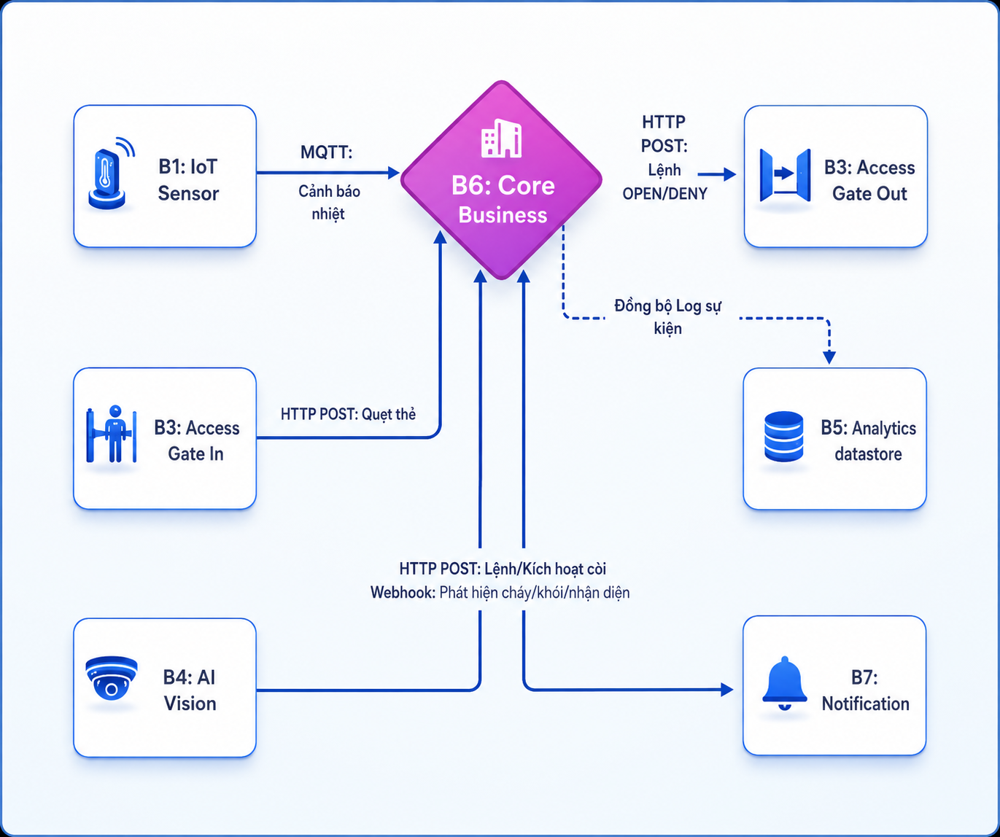
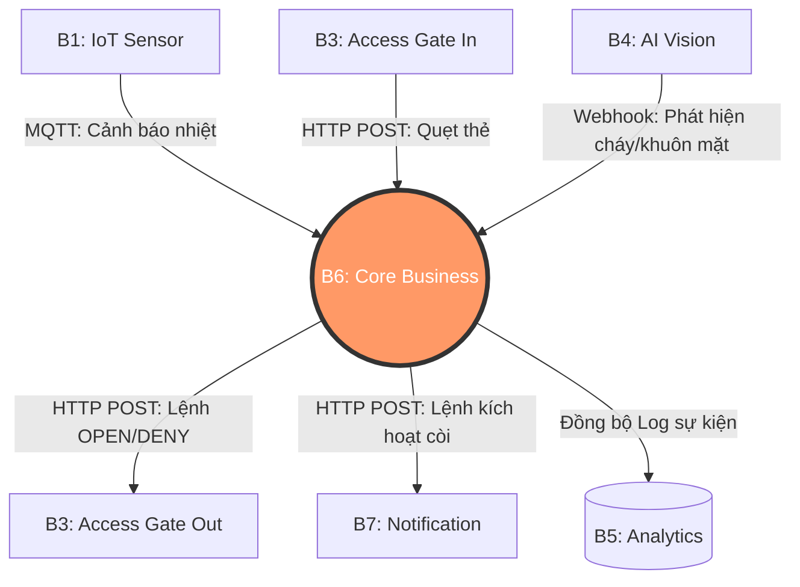

# Service Boundaries - Giới Hạn Của B6 (Core Business)

Tài liệu này xác định rõ trách nhiệm (Responsibility), luồng dữ liệu (Input/Output) và giới hạn nghiệp vụ (Boundary) của dịch vụ **B6 Core Business**, tuân thủ nghiêm ngặt nguyên tắc Single Responsibility trong kiến trúc Microservices.

## 1. Trách nhiệm Cốt lõi (In-Boundary)
- **Tổng hợp và Đánh giá rủi ro (Alert Correlation):** Tiếp nhận thông điệp rời rạc từ AI Vision (B4) và IoT (B1), đánh giá mức độ nghiêm trọng và quyết định hành động.
- **Điều phối phản ứng khẩn cấp (Orchestration):** Đưa ra luồng quyết định (Decision Making). Ví dụ: Kích hoạt báo động (B7) và mở toàn bộ cổng thoát hiểm (B3) khi có hỏa hoạn.
- **Kiểm soát truy cập (Access Policy Engine):** Nhận UID thẻ hoặc ID khuôn mặt từ cổng (B3), đối chiếu với Whitelist Database nội bộ để quyết định CẤP hay TỪ CHỐI quyền mở cửa.
- **Giám sát thời gian thực (Data Owner):** Quản lý trạng thái hệ thống hiện tại (Real-time state) và cung cấp API cho màn hình Web Dashboard giám sát. **B6 chính là Data Owner (Chủ sở hữu dữ liệu) duy nhất của trạng thái an ninh hệ thống thời gian thực.**

## 2. Nằm ngoài giới hạn (Out-of-Boundary)
- **Xử lý dữ liệu phần cứng thô:** B6 KHÔNG giao tiếp trực tiếp với phần cứng. B6 không đọc cảm biến nhiệt độ, không tự xử lý frame ảnh từ camera (Nhiệm vụ của B1, B2).
- **Lưu trữ dữ liệu lịch sử (Big Data):** B6 chỉ giữ trạng thái hiện tại. Việc lưu trữ Data Warehouse và báo cáo thống kê lịch sử thuộc về nhóm Analytics (B5).
- **Trực tiếp thao tác thiết bị:** B6 không phát xung điện đóng/mở cổng hay điều khiển còi hú, B6 chỉ gửi "Lệnh" (`HTTP POST`) để B3 và B7 thực thi.
- **Tính toán AI:** B6 không chạy các model nhận diện khuôn mặt sinh viên, B6 hoàn toàn gọi API ủy quyền việc này cho nhóm B4 xử lý.

## 3. Phân tích Luồng Dịch vụ (Upstream & Downstream)

Sơ đồ dưới đây minh họa trực quan vị trí trung tâm của B6 và luồng dữ liệu tương tác với các service khác:

*(Lưu ý: Nếu không xem được ảnh, bạn có thể tham khảo mã nguồn Mermaid bên dưới)*

Để hệ thống hoạt động, B6 giao tiếp với các dịch vụ xung quanh theo nguyên lý:

### 3.1. Upstream Services (Cung cấp Input cho B6)
Đây là các dịch vụ nằm "phía trên", đẩy dữ liệu đầu vào cho B6 xử lý.
- **B1 (IoT Cảm biến):**
  - *Vai trò:* Thu thập thông số môi trường.
  - *Input vào B6:* Bản tin MQTT cảnh báo vượt ngưỡng (Nhiệt độ cao, Rò rỉ khí).
- **B3 (Access Gate - Luồng In):**
  - *Vai trò:* Ghi nhận thao tác của người dùng tại cổng.
  - *Input vào B6:* API `POST /access/check` mang theo mã UID thẻ RFID vừa được quét.
- **B4 (AI Vision):**
  - *Vai trò:* Phân tích hình ảnh an ninh.
  - *Input vào B6:* Webhook `POST /ai/events` báo cáo nhận diện khuôn mặt hợp lệ hoặc cảnh báo phát hiện cháy/khói.

### 3.2. Downstream Services (Nhận Output từ B6)
Đây là các dịch vụ nằm "phía dưới", nhận lệnh hoặc kết quả xử lý từ B6 để thực thi.
- **B3 (Access Gate - Luồng Out):**
  - *Vai trò:* Thực thi hành động vật lý tại cổng.
  - *Output từ B6:* Lệnh `POST` trả về B3 chứa chỉ thị `OPEN` (mở) hoặc `DENY` (chặn) dựa trên kết quả kiểm tra Whitelist.
- **B7 (Notification / Alarm):**
  - *Vai trò:* Phát tín hiệu cảnh báo ra môi trường thực.
  - *Output từ B6:* Lệnh API gửi sang B7 kèm mức độ `CRITICAL` yêu cầu kích hoạt còi hú báo cháy lập tức.
- **B5 (Analytics):**
  - *Vai trò:* Kho dữ liệu lớn của trường.
  - *Output từ B6:* B6 định kỳ đẩy các log sự kiện (Ai ra vào giờ nào, cảnh báo nào đã xảy ra) sang B5 để lưu trữ dài hạn.
